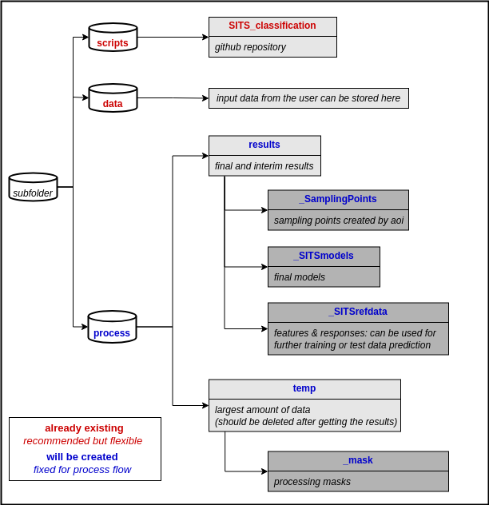
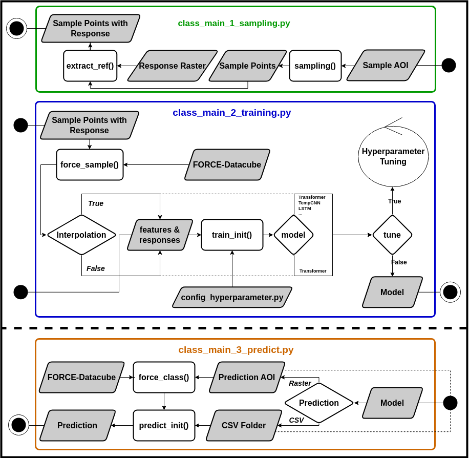

# SITS Classification

Code for SatelliteImageTimeSeries (SITS) Classification based on [FORCE Time Series Framework](https://force-eo.readthedocs.io/en/latest/index.html).


## 1. Installing
```
conda create --name SITSclass python==3.9
conda activate SITSclass
cd /path/to/repository/SITS_classification
pip install -r requirements.txt
sudo apt-get install xterm
```

_**Notes:**_

code is build upon FORCE-Datacube and -Framework (Docker, recommended FORCE-Version 3.7.11)

-> [How to Install FORCE with Docker](https://force-eo.readthedocs.io/en/latest/setup/docker.html#docker)

code is build upon CUDA 11.4 

_*Can also work with other versions but be careful with other libraries or changed functionalities*_

## 2. Getting Started

### 2.1 Basics
The script is based on the following folder structure:



**To use the scripts:**

Specify parameters within the _main_ scripts and execute them:

- class_main_1_sampling.py
- class_main_2_train.py
- class_main_3_predict.py

Recently Thermal Time for SITS Classification was integrated [Publication](https://arxiv.org/pdf/2203.09175), based on interpolated Soil Temperature Data from [DWD](https://opendata.dwd.de/climate_environment/CDC/grids_germany/daily/soil_temperature_5cm/)

Download most recently updated Thermal Time Raster from [here](https://cloud2.lup-umwelt.de/index.php/s/pM8FaSL5WgjP2PD)
 
 
**There are various entry points and use cases which are briefly presented in the following flowchart:**

To exclude FORCE for Training and use already existing Features & Responses take a look at the example files:
./pytorch/example/_SITSrefdata/...

Note: preprocess_settings.json is used to carry uniform settings from training to prediction with a model

 


## 2.2 Workflow

### a) Training

If you just want to Predict with existing model you can continue with chapter b) Prediction.

#### *class_main_1_sampling.py*

If you already have sample points with response variable you can skip the first Step but be aware:

- for classification you need continous values starting from [0, 1, 2, ...].

For parameter descriptions read the comments within the script. Please note:
- the input for the sampling script are one or multiple shapefiles that contain one polygon as area of interest 
- you can use the implementation for stratification by defining paths to raster files but expecially for multiple files be aware of the right order for shapefiles and startification raster files (naming)
- the output folder for sample points will be in ./results/_SamplingPoints/


#### *class_main_2_train.py*
Within the training script, there are 3 steps with their respective parameter settings:

- preprocess_params (preprocessing via FORCE & sampling of features for classification)
- args_train (parameters for model training)

The parameters are described in the respective file.

Especially for DeepLearning models Hyperparameters can be crucial. You can either configure them at *config_hyperparameter.py* or try different combinations by setting tune in args_train to True. While tuning hyperparameter a new folder next to the model will be created named optuna. To analyze hyperparameter tuning results open terminal and type the following:
```
conda activate SITSclass
optuna-dashboard /path/to/optuna/config
```

### b) Prediction
To make a prediction, simply define a project name and set the model path & shapefile for the study area.
The prediction is based on the year in the shapefile of the study area or can be self defined. 

Additionally, the following settings can be adjusted:
 
Chunksize can be modified --> A larger chunksize leads to faster calculations but may reach the GPU's limit with longer time series
Deep Learning models base their class predictions on probabilities. In addition to predicting target classes, the raw value can also be output with the 'probability' parameter.


## Versioning
2.0

## Changelog
2.0: Added Thermal Time for SITS Classification 


## Authors

* [**Benjamin Stöckigt**](https://github.com/Bensouh)

## License

This project is licensed under the GNU General Public Licence, Version 3 (GPLv3) - see the [LICENSE.md](LICENSE.md) file for details 

## Acknowledgments

* Time Series Classification based on [Marc Rußwurm](https://github.com/MarcCoru)

https://github.com/MarcCoru/crop-type-mapping

* Thermal Time Integration based on [Joachim Nyborg](https://github.com/jnyborg)
  
https://arxiv.org/pdf/2203.09175
